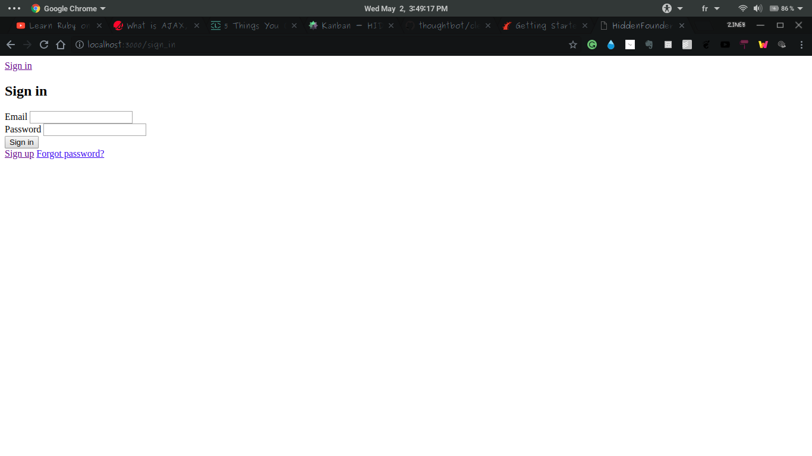

# Hidden Founders Challenge
## Web Coding Challenge
This is a **web application website** that I am going to code it as a `Full Stack Web Application`, by describing the technologies and the tools that I am going to work with, also by reporting all the modification. Every step will be detailed with all the information.

## THE WEB FRAMEWORK THAT I AM GOING TO USE
I am going to use the `Ruby on Rails`, I worked with many frameworks such as `Symfony` and `Laravel`, so I am going to switch to this technology for more exploration.

## THE MANAGEMENT PROJECT TOOL
I use the Management Project Tool called [Taiga](https://taiga.io), you can refer to my Public Project and all the steps in this link --> [Hidden Founders Challenge - Management Project Tool](https://tree.taiga.io/project/skarabi-full-stack-development-career/kanban?kanban-status=1479643)

## THE FIRST PART
### The Technologies of The Front-End
- HTML5 & CSS3
- Materialize CSS
- Jquery `Javascript Library`
- Angular
- React.Js
### The Technology of The Back-End
- `Ruby On Rails`
### The Database 
I am going to use the default Non-SQL Relational
- SQLite 3

## THE FUNCTIONAL 
After installing the `Ruby on Rails` in my local machine, please check below all the steps with some screeshots for all the progress work.
- [X] The Installation of Ruby on Rails on my local machine
> for the link of my `Installation Guideline` of [Ruby on Rails](https://gorails.com/setup/ubuntu/17.10), please refer to it for more details

- [X] Setting my Rails Application With an Interface Succeed 

- [X] The Sign Up 
> Signing up with email & password 
Before `Materialize CSS` 

After `Materialize CSS`

- [X] The Sign In 
> Signing in with email & password

This is the first `output before the design`, in this second illustration I am showing that I am sign in with the email that is shown.

> After using `Materialize CSS`

> For the `Sign Up & Sign In` I used [Clearance:Rails Authentication with email & password](https://github.com/thoughtbot/clearance).
